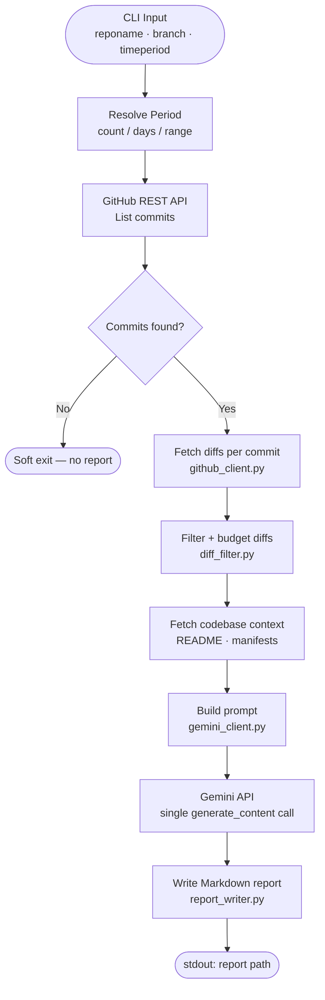

# code-commit-reviewer


> Automated AI code review for GitHub repositories — no GitHub App, no CI pipeline required.

Fetches commits over a time window, aggregates code-only diffs with lightweight codebase context, sends the payload to **Google Gemini** (`gemini-2.5-flash-lite`), and writes a structured Markdown report — all from a single local command.

---

## Features

- **Flexible time windows** — last N commits, last N days, or an explicit date range
- **Smart diff filtering** — extension whitelist, per-file size caps, aggregate budget trimming
- **Codebase context injection** — automatically attaches manifests and README for richer reviews
- **One Gemini call per run** — Flash-Lite tier keeps it cheap and fast
- **Portable Markdown artifact** — timestamped reports ready to share or archive
- **No GitHub App install** — runs entirely with a personal access token

---

## How It Works



---

## Architecture

```
code-reviewer.py     CLI, period resolver, orchestration, exit-code mapping
github_client.py     REST client — commits, diffs, context files, pagination, rate limits
diff_filter.py       Extension whitelist, per-file size caps, aggregate-budget trimming
gemini_client.py     System prompt, user prompt builder, single generate_content call
report_writer.py     Markdown header + LLM body + deterministic Commit Breakdown table
```

---

## Requirements

- Python 3.10+
- A GitHub fine-grained PAT with **Contents: Read** and **Pull requests: Read**
- A [Google Gemini API key](https://aistudio.google.com/app/apikey)

---

## Installation

```bash
git clone https://github.com/ridwanspace/code-commit-reviewer.git
cd code-commit-reviewer
pip install -r requirements.txt
```

---

## Configuration

Create a `.env` file in the project root:

```env
GITHUB_API_KEY=<fine-grained PAT with Contents:Read + Pull requests:Read>
GEMINI_API_KEY=<your Gemini API key>
```

---

## Usage

```bash
python3 code-reviewer.py --reponame <REPO> --branch <BRANCH> --timeperiod <PERIOD>
```

> Owner is hardcoded to `ridwanspace` — pass only the repository name.

### `--timeperiod` formats

| Format | Example | Meaning |
|---|---|---|
| Integer (1–200) | `10` | Last 10 commits on the branch |
| Days (1–365) | `7d` | Commits in the last 7 days (UTC) |
| Range | `2026-04-01:2026-04-17` | Commits between two dates (UTC, inclusive) |

### Optional flags

| Flag | Default | Purpose |
|---|---|---|
| `--output-dir <path>` | `./reports` | Directory where the Markdown report is written |
| `--max-context-bytes <int>` | `40000` | Cap on the codebase-context block sent to Gemini |
| `-v` / `--verbose` | off | Enable DEBUG logs: HTTP timings, rate headers, token estimates |

---

## Examples

**Last 7 days on a staging branch:**
```bash
python3 code-reviewer.py \
  --reponame my-service \
  --branch staging \
  --timeperiod 7d
```

**Explicit date range on main:**
```bash
python3 code-reviewer.py \
  --reponame my-service \
  --branch main \
  --timeperiod 2026-04-01:2026-04-17
```

**Last 15 commits, custom output directory:**
```bash
python3 code-reviewer.py \
  --reponame billing-service \
  --branch feature/stripe-migration \
  --timeperiod 15 \
  --output-dir ~/code-reviews
```

**Machine-parseable output** (last line is the report path):
```bash
REPORT=$(python3 code-reviewer.py --reponame my-service --branch main --timeperiod 7d | tail -1)
cat "$REPORT"
```

---

## Report Structure

Each generated report contains:

| Section | Description |
|---|---|
| **Header block** | Repo, branch, period, commit count, generated timestamp |
| **Summary** | Overall quality score + narrative summary |
| **Critical Issues** | Bugs, security flaws, data-loss risks |
| **Major Issues** | Significant design or correctness problems |
| **Minor Issues** | Style, naming, small inconsistencies |
| **Suggestions** | Improvements and refactoring ideas |
| **What Was Done Well** | Positive callouts |
| **Commit Breakdown** | Deterministic table rendered from GitHub data |

**Report path format:**
```
<output-dir>/review-<repo>-<branch>-<YYYYMMDD-HHMMSS>.md
```

Slashes in branch names are replaced with underscores (e.g. `feature/x` → `feature_x`). Timestamp is UTC.

---

## Exit Codes

| Code | Meaning |
|---|---|
| `0` | Report written, or no commits found in window (soft exit) |
| `1` | Missing `GITHUB_API_KEY` or `GEMINI_API_KEY` |
| `2` | Invalid CLI argument (`--reponame`, `--branch`, or `--timeperiod`) |
| `3` | Repository or branch not found / no access |
| `4` | GitHub rate limit exhausted |
| `5` | Gemini API call failed |
| `6` | Prompt exceeds safe token budget — narrow the time period |
| `7` | Could not write report (filesystem error) |
| `99` | Unexpected error — re-run with `--verbose` for full traceback |

---

## Non-Goals (v1)

PR mode, Slack/email delivery, multi-repo batch mode, CI gate, scheduling, streaming, and alternative LLM providers are out of scope for v1. See [`PRD.md`](./PRD.md) §12 for the deferred roadmap.

---

## License

MIT
